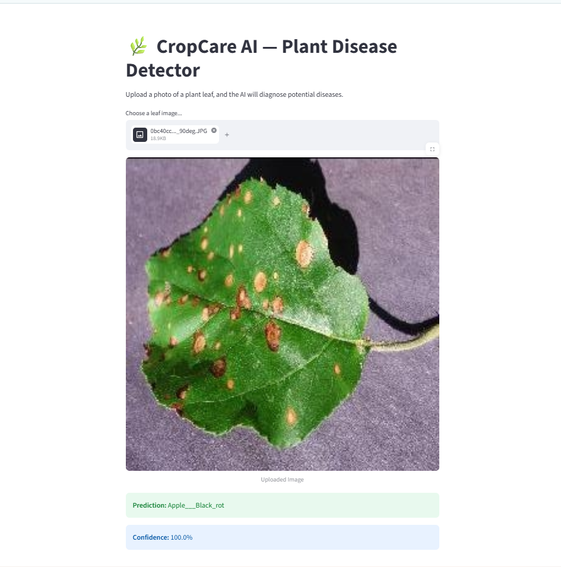

# 🌿 CropCare AI — Plant Disease Detector

An AI-powered web app that diagnoses plant leaf diseases from a photo, using a transfer-learning CNN (MobileNetV2) trained on the PlantVillage dataset (38 disease classes across multiple crop species).

🔗 **Live App:** https://cropcare-ai-manya.streamlit.app



## How It Works

1. Upload a photo of a plant leaf
2. The model analyzes it using a MobileNetV2-based CNN, fine-tuned on ~54,000 labeled leaf images
3. Get an instant diagnosis with a confidence score

## Tech Stack

- **Model:** TensorFlow / Keras, MobileNetV2 (transfer learning)
- **Frontend:** Streamlit
- **Dataset:** [New Plant Diseases Dataset (Augmented)](https://www.kaggle.com/datasets/vipoooool/new-plant-diseases-dataset) via Kaggle
- **Deployment:** Streamlit Community Cloud

## Running Locally

```bash
git clone https://github.com/manya-bhatt/cropcare-ai.git
cd cropcare-ai/app
pip install -r requirements.txt
streamlit run app.py
```

## Project Structure

```
cropcare-ai/
├── app/
│   ├── app.py              # Streamlit app
│   ├── best_model.keras    # Trained model
│   ├── class_names.json    # Class index mapping
│   └── requirements.txt
└── README.md
```